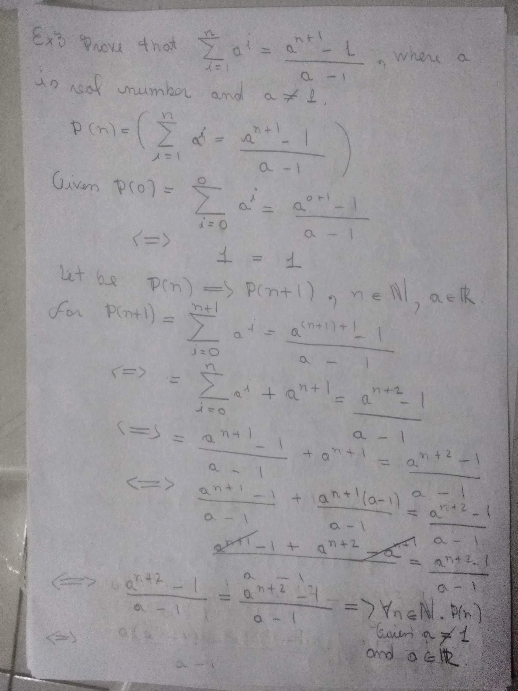
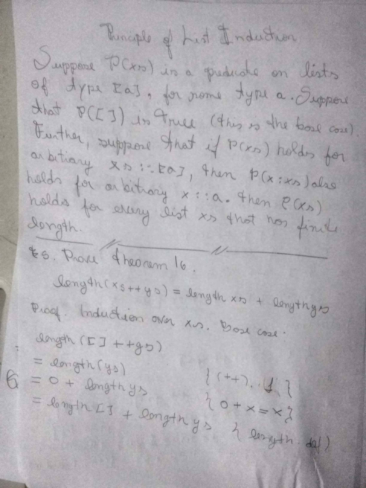
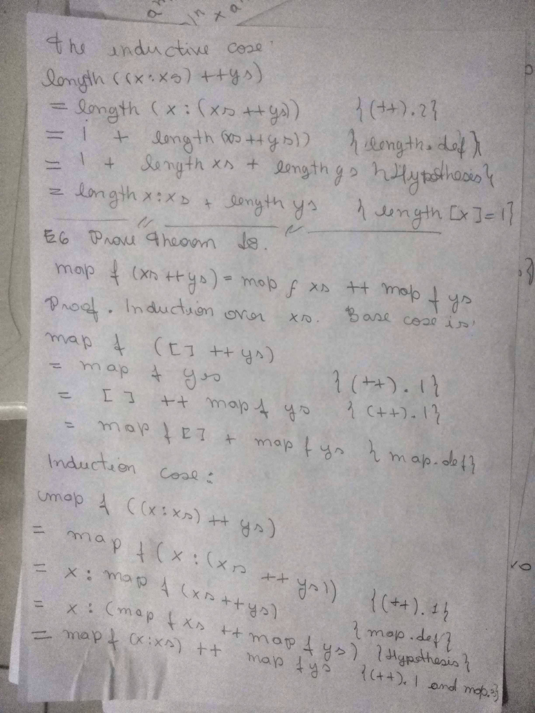
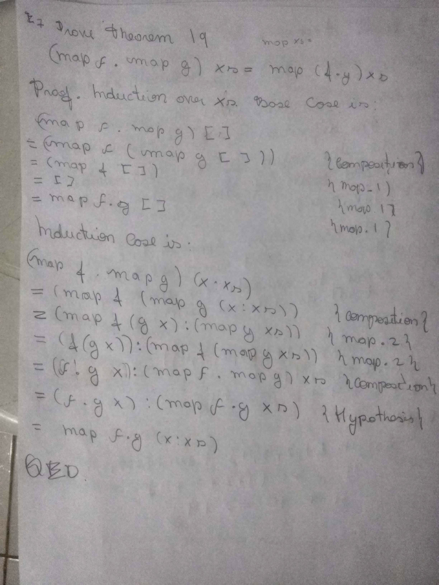
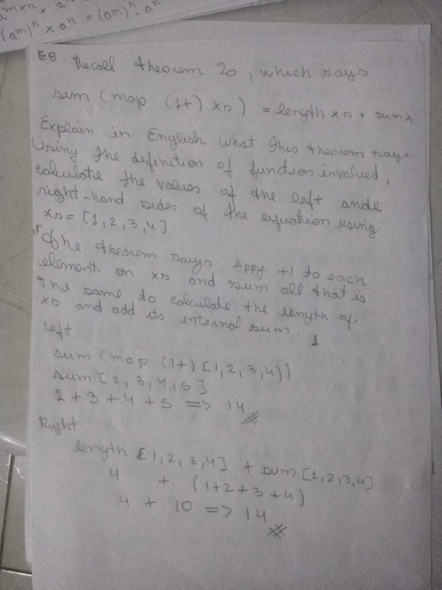
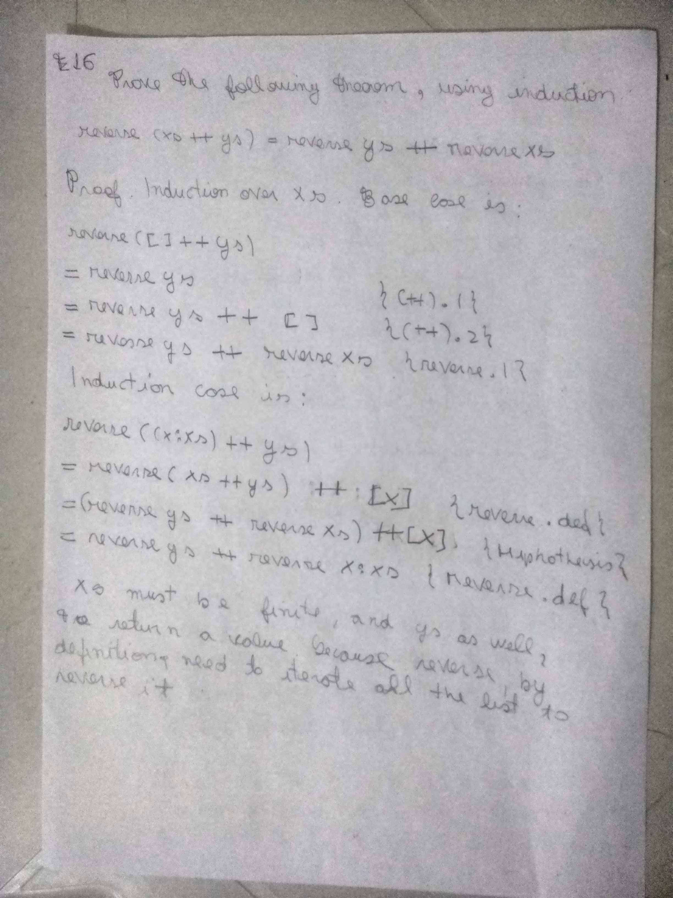
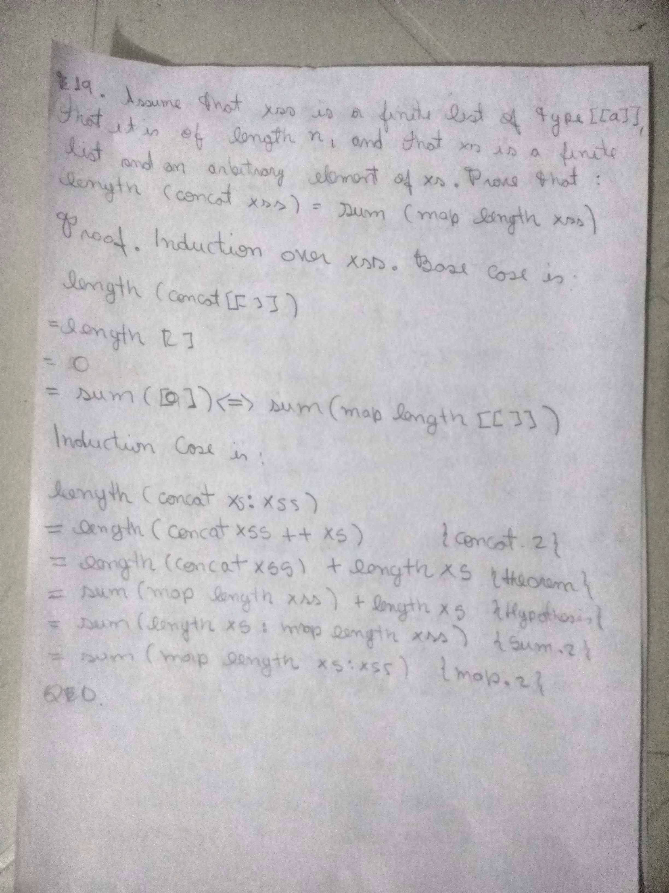
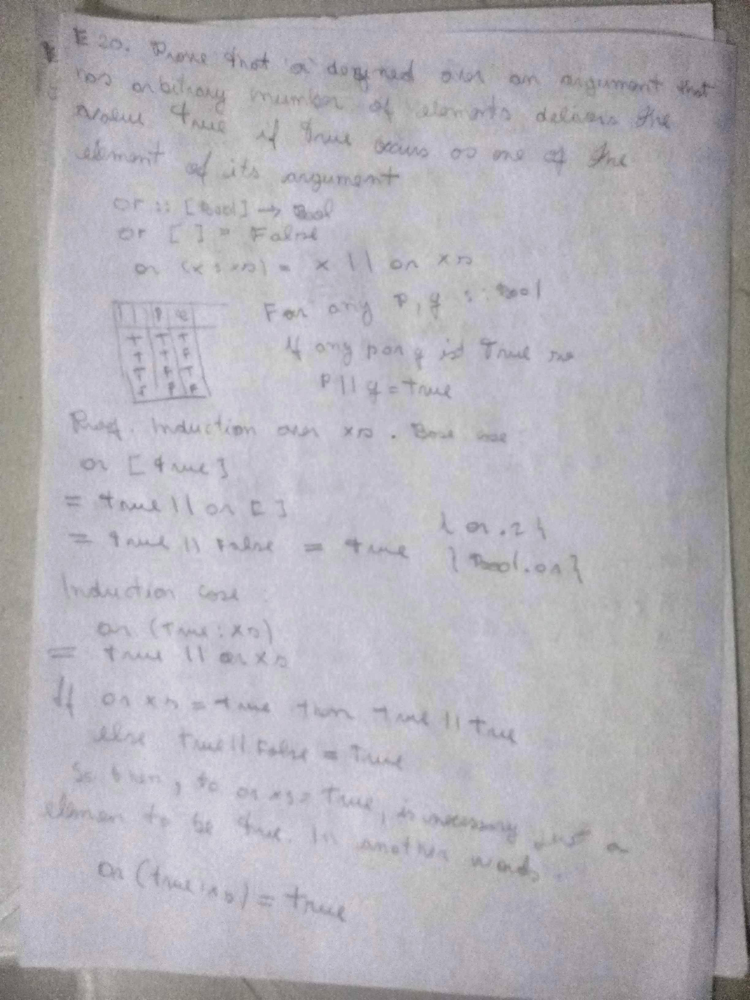
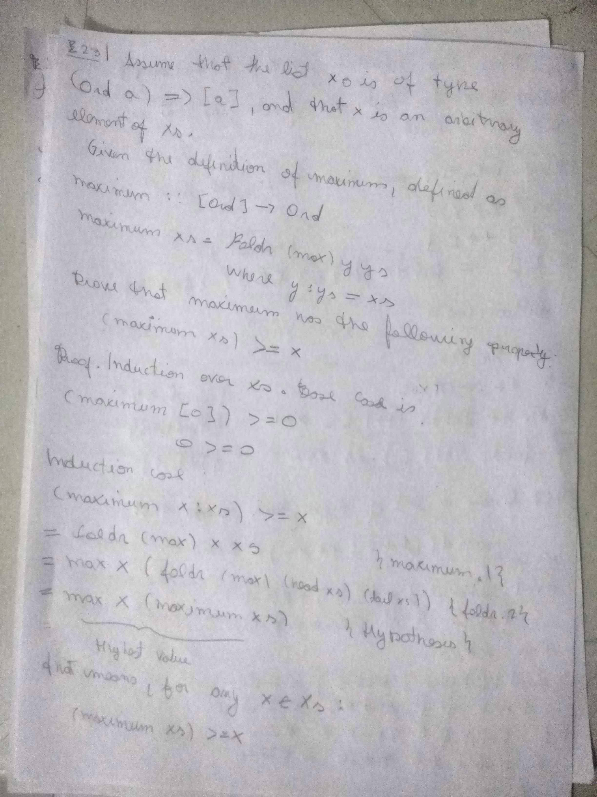

# Handwritten Answers

# Mathematical Induction
Just mathematical induction through the natural numbers.

## Exercise 1

## Exercise 2

## Exercise 3

## Exercise 4


# List Induction
The real part to prove recursive programs that handles lists.

## Exercise 5


## Exercise 6


## Exercise 7


## Exercise 8


## Exercise 9


## Exercise 10-11


## Exercise 12-14


## Exercise 15
HAHAHA, the exercise 15 was so stupid that I forgot to solve it.
Was just it:
> Evaluate [1,2,3] for theorem 27 and check if is true.:

```haskell
-- theorem 27
(reverse (reverse xs)) = xs
```

Whose, in that case, stands for true.
The problem with this is theorem is just for
when xs is a infinite list. For finite lists this works fine.

# Exercise 16


## Exercise 17-18


## Exercise 19


## Exercise 20


## Exercise 23


## Exercise 25-27


## Haskell Solutions

* Exercise [22, 24 and 26](exercises.hs)
